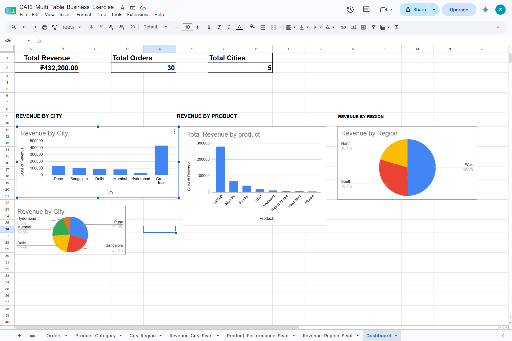

# DA15-Multi-Table-Business-Exercise
## Project Overview

This project analyzes sales data using Excel/Google Sheets.

The goal was to perform business analysis using lookup tables, Pivot Tables, charts, and dashboards.

---

## Dataset

The dataset contains:

- Order ID
- Product
- City
- Revenue

Additional lookup tables were created for:

- Product → Category
- City → Region

---

## Skills Used

- VLOOKUP
- Pivot Tables
- Data Analysis
- Dashboard Design
- Business Insights
- Revenue Analysis

---

## Key Metrics

- Total Revenue: ₹432,200
- Total Orders: 30
- Total Cities: 5

---

## Business Insights

- Pune generated the highest revenue.
- Hyderabad generated the lowest revenue.
- Laptop was the highest-performing product.
- Mouse was the lowest-performing product.
- West region generated the highest revenue.

---

## Dashboard Preview

---

## Tools Used

- Microsoft Excel / Google Sheets
